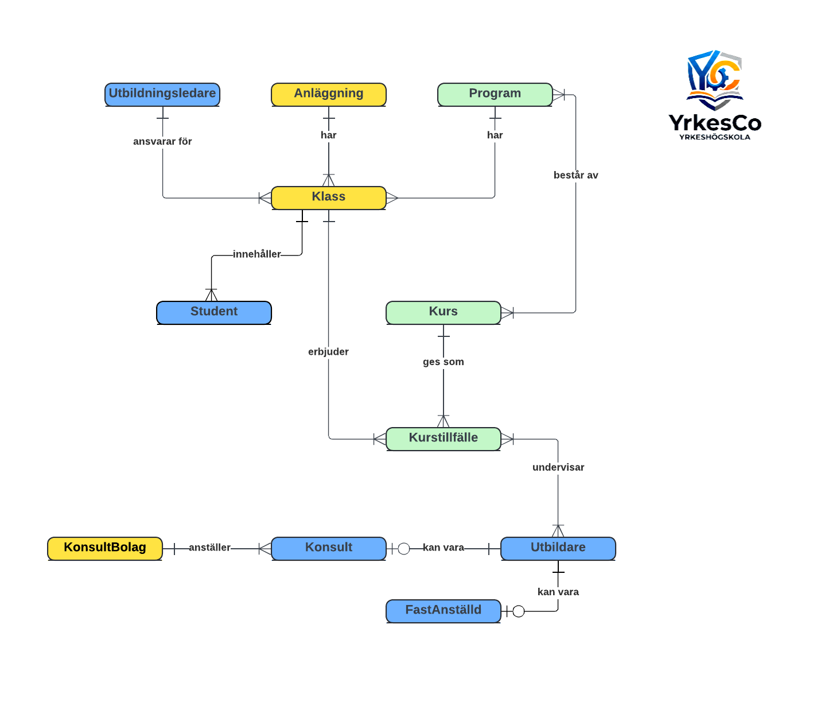

# YrkesCo Databasdesign

## Projektbeskrivning
Detta projekt innehåller databasdesignen för YrkesCo, en fiktiv yrkeshögskola som vill ersätta sina Excel-filer med en centraliserad databas.

## Konceptuell modell

### Färgkodning
- 🟦 **Blå**: Personer och roller (Student, Utbildare, Utbildningsledare, Konsult, FastAnställd)
- 🟨 **Gul**: Organisatoriska enheter (Anläggning, Klass, KonsultBolag)
- 🟩 **Grön**: Utbildningsrelaterade entiteter (Program, Kurs, Kurstillfälle)

Relational statements återfinns i en separat textfil

